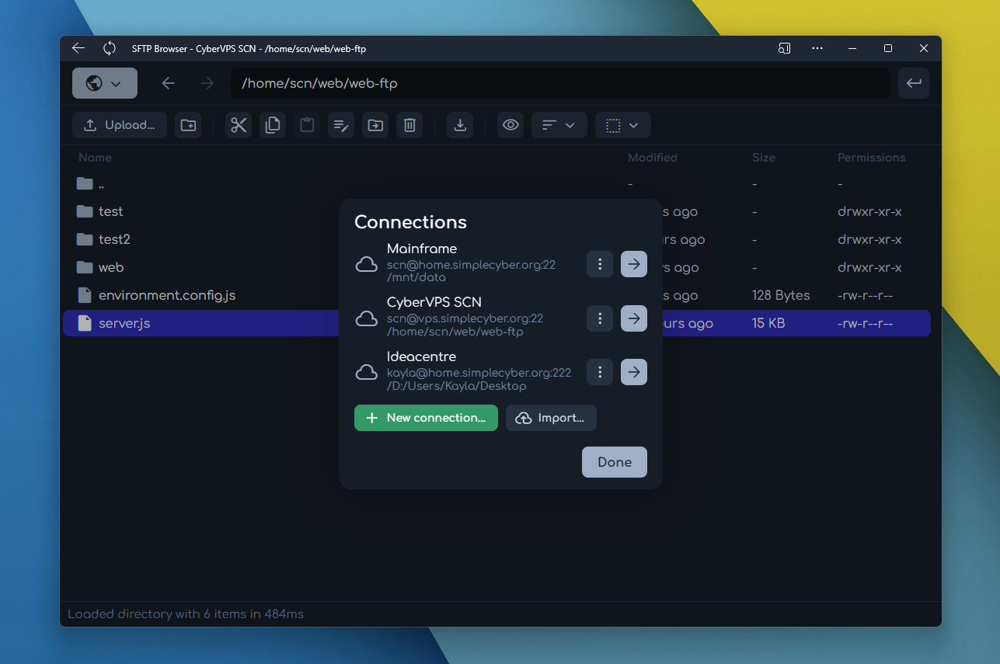

# sftp-browser
A web-based SFTP file browser that makes managing your server files easy!



SFTP Browser is still in development, but you can play with it at [sftpbrowser.cybah.me](https://sftpbrowser.cybah.me). In addition to the web interface, there's a fully-built SFTP HTTP API that's used for interfacing with the origin server.

This line was written using the text file editor built into SFTP Browser!!

## API

### Authentication
All API endpoints require a set of request headers for connecting to the target server:
* `sftp-host`: The hostname of the server
* `sftp-port`: The port of the server
* `sftp-username`: The username to log into
* `sftp-password`: The password, if using password authentication
* `sftp-key`: The **private** key, if using public key authentication

### Response format
All API responses are in JSON format and include a boolean `success` property. This is `true` if no errors were encountered, or `false` otherwise. If an error was encountered, a string `error` property is included, which contains an error message.

Successful response example:
```json
{
    "success": true,
    "...": "..."
}
```

Failed response example:
```json
{
    "success": false,
    "error": "[error message]",
    "...": "..."
}
```

Failed responses may contain other properties included in the successful response, depending on when in the process the error occurred.

Neither potential error messages nor these additional properties will be documented. 

### Endpoints

#### `GET /api/sftp/directories/list`
Gets the immediate contents of a directory.

##### Query params
* Required string `path`: The target directory path
* Optional boolean `dirsOnly`: If `true`, only directories will be returned

##### Response
* string `path`: The normalized path
* object[] `list`: An array of file objects
    * string `list[].name`: The name of this file
    * number `list[].accessTime`: A timestamp representing the last access time of this file
    * number `list[].modifyTime`: A timestamp representing the last modification time of this file
    * number `list[].size`: The size, in bytes, of this file
    * string `list[].type`: A 0 or 1 character length string representing the generic type of this file. `-` represents a file, `d` represents a directory, etc.
    * number `list[].group`: The ID of the group this file belongs to
    * number `list[].owner`: The ID of the user this file belongs to
    * object `list[].rights`: Permissions for this file
        * string `list[].rights.user`: Contains some arrangement of `r`, `w`, and `x`, representing the permissions the owner has for this file.
        * string `list[].rights.group`: Contains some arrangement of `r`, `w`, and `x`, representing the permissions the group has for this file.
        * string `list[].rights.other`: Contains some arrangement of `r`, `w`, and `x`, representing the permissions everyone else has for this file.
* string `list[].longname`: The raw SFTP output representing this file

#### `POST /api/sftp/directories/create`
Creates a directory.

#### `DELETE /api/sftp/directories/delete`
Deletes a directory and its contents.

#### `GET /api/sftp/files/exists`
Checks if a file exists. Response success is true if the file exists, regardless of read permissions.

#### `GET /api/sftp/files/stat`
Gets the details about a file or directory.

#### `GET /api/sftp/files/get/single`
Gets a file's raw data, with the response's MIME type set accordingly, or a normal JSON error response on failure.

#### `GET /api/sftp/files/get/single/url`
Gets a temporary URL to download a single file without the need for connection headers.

#### `GET /api/sftp/files/get/multi`
Gets a temporary URL for downloading a set of files and directories as a zip archive without the need for connection headers.

#### `POST /api/sftp/files/create`
Creates a file and appends the raw request body to it.

#### `PUT /api/sftp/files/append`
Appends the raw request body to a file, creating it if it doesn't exist.

#### `PUT /api/sftp/files/move`
Moves a file or directory from one location to another.

#### `PUT /api/sftp/files/copy`
Copies a file from one location to another. Directories not supported.

#### `PUT /api/sftp/files/chmod`
Changes a file's permissions. Directories are supported, but with no recursion.

#### `DELETE /api/sftp/files/delete`
Deletes a file.